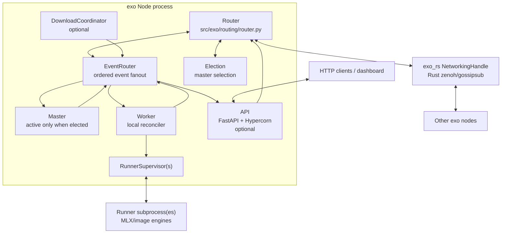
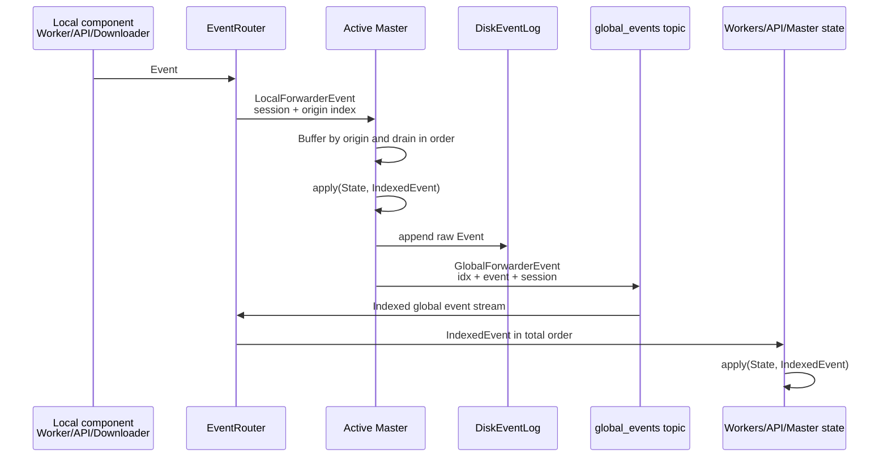
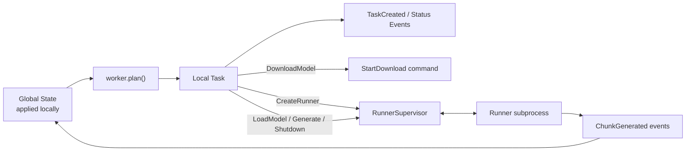
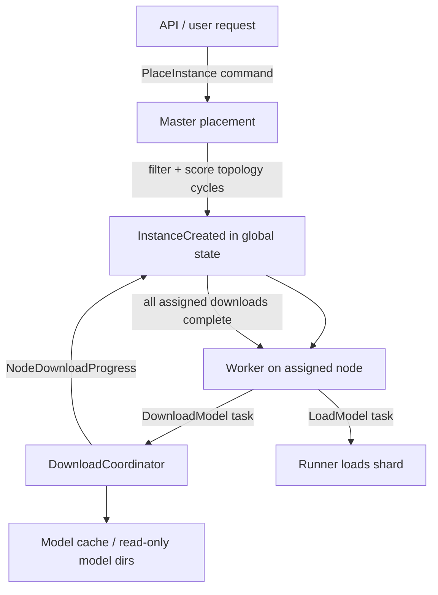
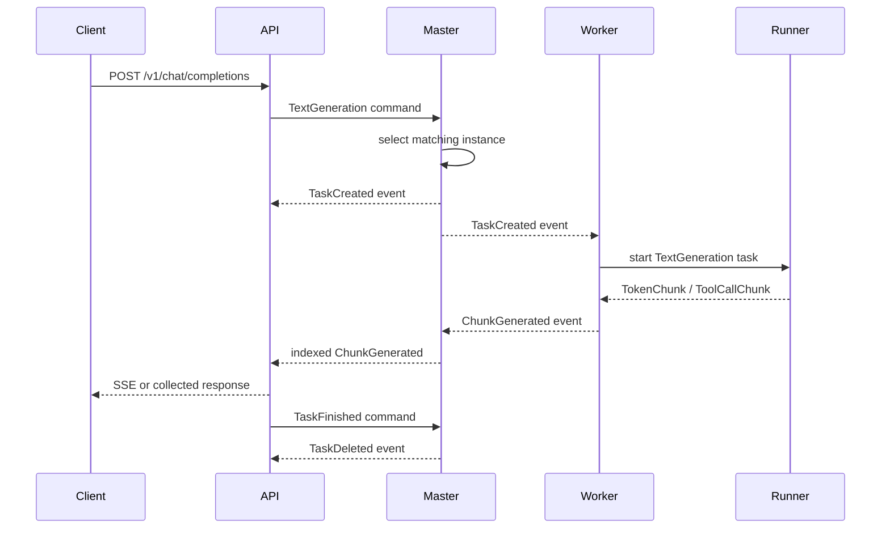

# exo Infrastructure Report

This report explains the runtime infrastructure of exo: how a node is assembled, how nodes communicate, how cluster state is replicated, and how inference work moves from an HTTP request to one or more model runner processes.

## System Summary

exo is a distributed inference system. Each machine runs an exo node, and each node can host the same set of cooperating services:

- a Rust-backed zenoh/gossipsub router for peer-to-peer messaging
- an election participant for master selection
- a master coordinator when the node is elected master
- a worker that reconciles global state into local side effects
- an optional download coordinator
- an optional FastAPI/Hypercorn API server that also serves the dashboard
- supervised runner subprocesses that load model shards and execute inference tasks

The important infrastructure choice is event sourcing. Components do not mutate a shared database. Instead, local systems emit typed events, the active master indexes them into a total order, and every node applies the ordered event stream to derive the same immutable `State`.

## Runtime Composition

`src/exo/main.py` defines the `Node` composition. A node creates the router first, registers all topics, then wires the router channels into higher-level services. The process uses `anyio` task groups, so the node runs as a collection of async services in one Python process, with runner subprocesses created only when model instances need local execution.

Every node starts election-capable. The master role is dynamic: when a new election result arrives, the node may promote itself to master, demote itself, or rebuild session-scoped components so they consume events from the new session.

## Network Topics

Typed pub/sub topics are declared in `src/exo/routing/topics.py`. Each topic binds a string name, a publish policy, and a Pydantic model type used for JSON serialization.

| Topic | Model | Purpose |
| --- | --- | --- |
| `global_events` | `GlobalForwarderEvent` | Master broadcasts indexed events to the cluster. |
| `local_events` | `LocalForwarderEvent` | Local systems send unindexed events to the active master. |
| `commands` | `ForwarderCommand` | API and workers send commands for the master to interpret. |
| `election_messages` | `ElectionMessage` | Nodes campaign and converge on a master session. |
| `connection_messages` | `ConnectionMessage` | Local-only router connection updates from Rust networking. |
| `download_commands` | `ForwarderDownloadCommand` | Workers/API/master target model download actions at nodes. |

`src/exo/routing/router.py` bridges local async channels to the Rust `NetworkingHandle`. The Rust layer in `rust/exo_rs/src/networking.rs` exposes async Python bindings for subscribing, publishing, and receiving gossipsub messages. Connection discovery and expiry messages are converted into local `ConnectionMessage` values and are not republished.

## Event-Sourced State

`src/exo/shared/types/state.py` defines the global `State`. It tracks:

- model instances and runner statuses
- downloads by node
- in-flight tasks
- topology and last-seen timestamps
- node memory, disk, network, Thunderbolt, RDMA, backend, and identity data
- prefill/decode instance links and prefill server ports
- custom model cards

The reducer in `src/exo/shared/apply.py` is the only place where indexed events are converted into a new state snapshot. It asserts that events are applied in order, using `last_event_applied_idx`.

The `EventRouter` handles two reliability concerns:

- Local outbound events are retried until the corresponding indexed global event is seen.
- Out-of-order global events trigger a `RequestEventLog` command so the master can replay missing events from disk.

## Master Infrastructure

`src/exo/master/main.py` is the cluster coordinator. The active master consumes commands and local events, derives new events, indexes them, and broadcasts them.

Primary responsibilities:

- turn generation commands into `TaskCreated` events
- choose instances with the fewest in-flight tasks
- place instances based on topology, memory, backend support, sharding mode, and download progress
- create/delete prefill-decode instance links
- cancel unnecessary downloads after instance deletion
- remove dead nodes and broken instances through a periodic planning loop
- merge tracing events from distributed ranks
- serve event log replay requests

The master does not directly run inference or download files. It emits events and download commands that workers and download coordinators turn into local side effects.

## Worker and Runner Infrastructure

`src/exo/worker/main.py` is the node-local reconciler. It applies the global event stream to local state, periodically runs `src/exo/worker/plan.py`, and executes exactly one derived local task at a time when work is needed.

The worker planning order is significant:

1. cancel tasks
2. kill invalid or failed runners
3. create missing local runners
4. request model downloads
5. initialize distributed backend connections
6. load models
7. warm up loaded models
8. start pending generation tasks

Runner processes are supervised by `src/exo/worker/runner/supervisor.py`. The supervisor owns multiprocessing channels to the runner entrypoint, forwards runner events back into the event stream, captures stdout/stderr, tracks pending and completed tasks, and handles shutdown or cancellation.

This keeps side effects local and repeatable: the state says what should exist, and each worker decides what it must do on its own node to make that true.

## Placement and Downloads

In this document, placement means the master's scheduling decision for where a model instance lives in the cluster and how that model is split across nodes. A placement maps model shards to runner ids and node ids. It is not software deployment; it is the cluster-level decision that says, for example, which node runs rank 0, which node runs rank 1, and which shard each runner should load.

Placement is implemented in `src/exo/master/placement.py`. Given a `PlaceInstance` command, the master:

- finds topology cycles with at least the requested number of nodes
- filters by required nodes, memory capacity, model sharding constraints, and backend support
- prefers RDMA cycles for `MlxJaccl`
- favors cycles with leaf nodes when available
- scores candidates by existing model download progress and available memory
- creates `MlxRingInstance` or `MlxJacclInstance` metadata with runner and shard assignments

Downloads are handled separately by `src/exo/download/coordinator.py`. A worker that sees a local runner needing model files emits a targeted `StartDownload`. The download coordinator checks existing model directories first, supports offline mode, emits throttled `NodeDownloadProgress`, and can cancel or delete local downloads.

## API Infrastructure

`src/exo/api/main.py` builds the HTTP API with FastAPI and serves it through Hypercorn. It also mounts the built dashboard directory as static files.

The API surface includes:

- OpenAI-compatible `/v1/chat/completions`
- OpenAI Responses API `/v1/responses`
- Anthropic-compatible `/v1/messages`
- Ollama-compatible routes under `/ollama`
- image generation and image edits endpoints
- instance placement and lifecycle endpoints
- download lifecycle endpoints
- state, events, traces, model search, and custom model management endpoints

The API converts HTTP requests into commands, sends them through the command topic, applies the global event stream locally, and streams generated chunks back to the caller through command-id keyed queues. During elections, it pauses request handling until a completed election establishes the active session.

## Election and Sessions

Election logic lives in `src/exo/shared/election.py`. Each node participates and broadcasts an `ElectionMessage` containing:

- election clock
- seniority
- proposed `SessionId`
- number of commands seen

Candidates are ordered by clock, seniority, commands seen, and proposed master node id. Connection changes start new campaigns. The resulting `SessionId` scopes local and global events, which prevents old-session events from being applied after a new master is selected.

When a node receives a new election result, `Node._elect_loop()` handles the infrastructure transition:

- rebuild the `EventRouter` for the new session
- promote or demote the `Master`
- restart the download coordinator and worker when the session changes
- reset or recreate API state so it consumes the new indexed event stream

## Topology and Health

Topology is built from multiple sources:

- Rust networking reports peer discovery and expiry to the election layer.
- `InfoGatherer` emits memory, disk, backend, network, Thunderbolt, RDMA, and identity data as `NodeGatheredInfo`.
- Workers periodically probe peer API ports and emit socket topology edges.
- `apply_node_gathered_info()` derives RDMA edges from Thunderbolt and `rdma_ctl` status.
- The master periodically emits `NodeTimedOut` when a node has not refreshed `last_seen` for more than 30 seconds.

Placement depends on this topology and hardware profile data, so health and profiling events are first-class cluster state.

## Operational Model

A typical startup path is:

1. Build the dashboard so `DASHBOARD_DIR` exists.
2. Start `uv run exo`.
3. The node creates a random node id for the session and starts the Rust networking handle.
4. The router subscribes to all typed topics.
5. Election runs immediately and then on connection changes.
6. The API, worker, downloader, and master consume the session-scoped event stream.
7. Node info and download progress events populate global state.
8. API requests create commands, master indexes resulting events, workers reconcile state, and runners execute inference.

The system is designed so most infrastructure state is recoverable from the master event log and the current global event stream. Local side effects such as downloaded files and runner processes are reconciled by workers rather than treated as authoritative cluster state.

## Key Source Map

| Area | Files |
| --- | --- |
| Node composition | `src/exo/main.py` |
| Routing topics and router | `src/exo/routing/topics.py`, `src/exo/routing/router.py` |
| Event ordering and retries | `src/exo/routing/event_router.py` |
| Election | `src/exo/shared/election.py` |
| Master coordination | `src/exo/master/main.py` |
| Placement | `src/exo/master/placement.py`, `src/exo/master/placement_utils.py` |
| Global state and reducer | `src/exo/shared/types/state.py`, `src/exo/shared/apply.py` |
| Worker reconciliation | `src/exo/worker/main.py`, `src/exo/worker/plan.py` |
| Runner supervision | `src/exo/worker/runner/supervisor.py`, `src/exo/worker/runner/bootstrap.py` |
| Downloads | `src/exo/download/coordinator.py` |
| HTTP API and dashboard serving | `src/exo/api/main.py` |
| Rust networking bindings | `rust/exo_rs/src/networking.rs` |
