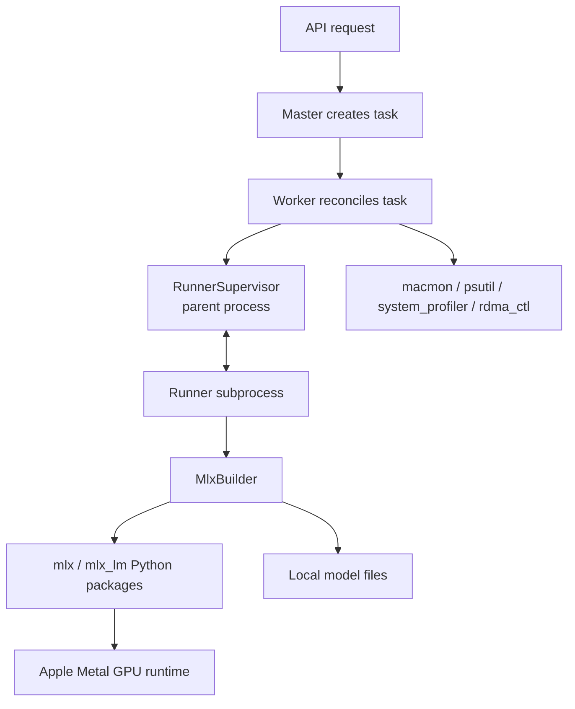
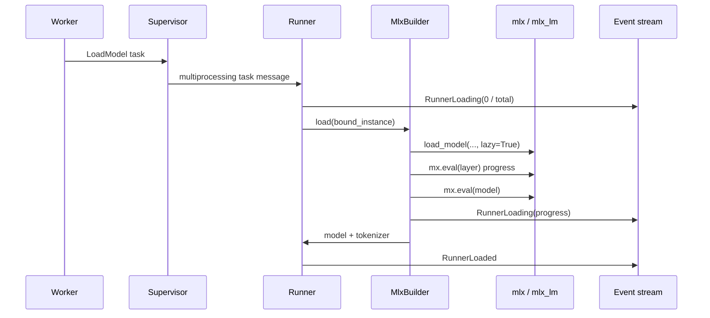
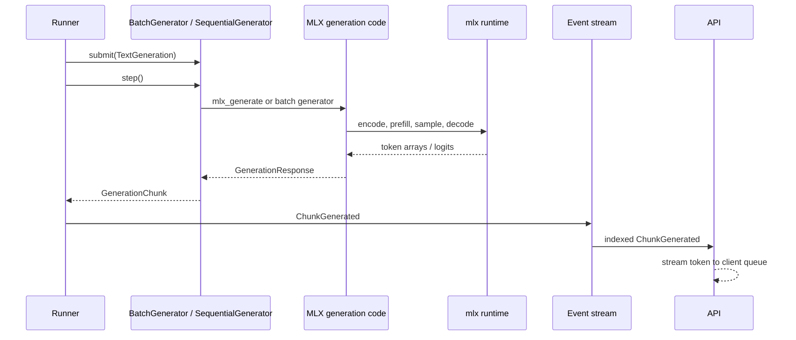
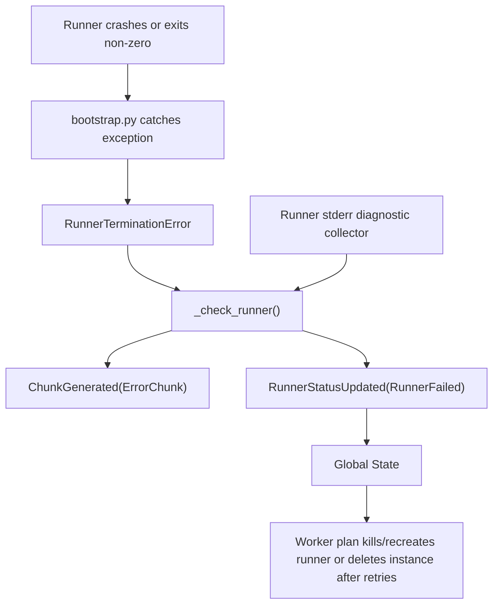
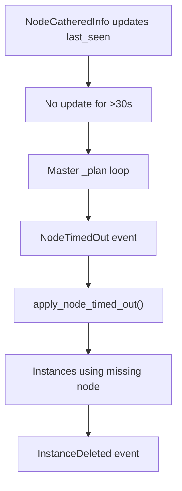

# exo Machine Interface Report

This document explains how exo touches the local machine: how it reaches MLX and Metal on a Mac, where hardware-facing code lives, how model runner failures are surfaced, and how node reachability is detected.

The intended reader is a junior full stack developer. Some terms:

- **MLX** is Apple's machine learning array/model framework used by this project for local inference.
- **Metal** is Apple's GPU API. exo does not call Metal directly; it calls MLX, and MLX uses Metal underneath when available.
- **Runner** means the subprocess that actually loads a model shard and runs inference.
- **Node** means one running exo process on one machine.
- **Unhealthy model** is not a single formal state in the code. In practice, it means the runner for a model instance failed, the model files failed to download/load, or the node hosting the model became unreachable.

## High-Level Machine Boundary

exo's main process coordinates the cluster, but model execution happens in runner subprocesses. Those subprocesses import MLX, load model files from disk, allocate MLX arrays, initialize distributed MLX groups when needed, and run generation loops.



The important point: exo mostly talks to machine hardware through libraries and command-line tools:

- GPU inference: `mlx`, `mlx_lm`, and image model code using MLX arrays.
- Metal: indirectly through MLX.
- Mac metrics: `macmon`, `psutil`, `system_profiler`, and `rdma_ctl`.
- Networking/discovery: Rust zenoh code plus Python HTTP probes.
- Process isolation: Python multiprocessing through `AsyncProcess`.

## Where MLX and Metal Are Used

The core MLX code lives under `src/exo/worker/engines/mlx/`.

| Purpose | Code |
| --- | --- |
| Select MLX builder for text models | `src/exo/worker/runner/bootstrap.py` |
| MLX builder lifecycle | `src/exo/worker/engines/mlx/builder.py` |
| MLX distributed init, model loading, tokenizer loading, Metal memory settings | `src/exo/worker/engines/mlx/utils_mlx.py` |
| Text generation loop | `src/exo/worker/engines/mlx/generator/generate.py` |
| Continuous batching | `src/exo/worker/engines/mlx/generator/batch_generate.py` |
| Engine wrapper around generation | `src/exo/worker/runner/llm_inference/batch_generator.py` |
| Vision model support | `src/exo/worker/engines/mlx/vision.py` |
| Image generation MLX code | `src/exo/worker/engines/image/` |

The runner subprocess starts in `src/exo/worker/runner/bootstrap.py`. Before importing the MLX builder, it sets:

```text
MLX_METAL_FAST_SYNCH=1
```

unless `EXO_FAST_SYNCH=false`, in which case it sets:

```text
MLX_METAL_FAST_SYNCH=0
```

That environment variable is read by MLX's Metal backend. This is one of the few places where exo directly configures Metal behavior.

The direct MLX imports look like this throughout the engine code:

```python
import mlx.core as mx
import mlx.nn as nn
from mlx_lm.utils import load_model
```

exo then calls MLX APIs such as:

- `mx.distributed.init(...)` for distributed inference groups
- `mx.eval(...)` to force lazy MLX computations to execute
- `mx.clear_cache()` to release MLX cached memory
- `mx.reset_peak_memory()` before generation
- `mx.metal.is_available()` to check whether Metal is available
- `mx.device_info()` to read MLX device metadata
- `mx.set_wired_limit(...)` to adjust Metal-backed memory behavior

## Model Loading Path

Model loading starts when the worker plan decides that a runner is ready for `LoadModel`.



For a single-device model, `load_mlx_items()` in `utils_mlx.py`:

1. Computes a Metal wired memory limit with `set_wired_limit_for_model()`.
2. Builds the local model path.
3. Calls `mlx_lm.utils.load_model(model_path, lazy=True, strict=False)`.
4. Tries to evaluate layers one by one using `mx.eval(layer)` so the UI can show load progress.
5. Calls `mx.eval(model)` to force the full model to load.
6. Loads the tokenizer.
7. Optionally loads vision weights.

For a distributed model, it first initializes an MLX distributed group, then loads only the assigned shard.

## Distributed MLX and Hardware Links

Distributed MLX setup lives in `mlx_distributed_init()` in `src/exo/worker/engines/mlx/utils_mlx.py`.

There are two supported instance styles:

- `MlxRingInstance`: uses MLX distributed backend `ring`.
- `MlxJacclInstance`: uses MLX distributed backend `jaccl`, intended for RDMA-capable Mac clusters.

For `MlxRingInstance`, exo writes a temporary host file and sets:

```text
MLX_HOSTFILE=/tmp/.../hosts_<instance>_<rank>.json
MLX_RANK=<rank>
```

Then it calls:

```python
mx.distributed.init(backend="ring", strict=True)
```

For `MlxJacclInstance`, exo writes a temporary device matrix and sets:

```text
MLX_IBV_DEVICES=/tmp/.../hosts_<instance>_<rank>.json
MLX_RANK=<rank>
MLX_JACCL_COORDINATOR=<ip:port>
```

Then it calls:

```python
mx.distributed.init(backend="jaccl", strict=True)
```

The placement logic that decides whether `MlxJaccl` is allowed lives in:

- `src/exo/master/placement.py`
- `src/exo/master/placement_utils.py`
- `src/exo/shared/apply.py`

`apply_node_gathered_info()` derives RDMA topology from Thunderbolt and `rdma_ctl` status. Placement rejects `MlxJaccl` if there is no RDMA-connected cycle with `rdma_ctl` enabled on every node.

## Generation Path

After a model is loaded and warmed up, generation flows through the runner's engine.



The lower-level generation code uses MLX arrays for prompt tokens, KV cache, logits, sampling, prefill, and token generation. That is the path where GPU work is actually triggered. Calls like `mx.eval(...)`, `mx.matmul(...)`, and model forward passes are delegated to MLX, and MLX decides whether to use Metal.

## Mac Hardware and System Information

Hardware and system profiling lives mostly in `src/exo/utils/info_gatherer/info_gatherer.py`.

`InfoGatherer.run()` starts different monitors depending on the OS. On macOS it starts:

- `macmon` monitoring for memory and system metrics
- `system_profiler` Thunderbolt monitoring
- Thunderbolt Bridge status monitoring
- `rdma_ctl` status monitoring
- network interface monitoring
- static node info
- disk usage
- backend detection

Backend detection is intentionally simple:

```python
backends = [Backend.MlxCpu]
if IS_DARWIN:
    backends.append(Backend.MlxMetal)
if CUDA is available through NVML:
    backends.append(Backend.MlxCuda)
    backends.append(Backend.Vllm)
```

That means a Mac advertises `MlxMetal` because it is Darwin/macOS. The stronger runtime check happens later in MLX code, for example `mx.metal.is_available()` inside `set_wired_limit_for_model()`.

Mac metric fallback behavior is logged. For example, if `macmon` is missing or unusable, the code logs a warning and falls back to `psutil` memory monitoring.

## How Model Failures Are Logged

There are two broad failure paths.

### Failure Path 1: Recoverable Request Error

The engine wrappers in `src/exo/worker/runner/llm_inference/batch_generator.py` catch some exceptions while building or stepping a generation. They emit an `ErrorChunk` for the command:

```text
ChunkGenerated(command_id=..., chunk=ErrorChunk(..., error_message=str(e)))
```

Then they re-raise the exception. If the exception escapes the runner main loop, it becomes a runner crash.

This means the client may see an error chunk, and the runner may also transition to failed depending on whether the error is fatal.

### Failure Path 2: Runner Process Failure

Fatal runner failures are handled by:

- `src/exo/worker/runner/bootstrap.py`
- `src/exo/worker/runner/supervisor.py`
- `src/exo/worker/runner/diagnostics.py`

When the runner subprocess crashes, `bootstrap.py` logs:

```text
Runner <runner_id> crashed with critical exception <error>
```

It sends a `RunnerTerminationError` back to the supervisor. The supervisor then:

1. Checks the runner process exit code.
2. Logs the exit code or signal.
3. Looks through captured runner stderr for known diagnostics.
4. Sends an `ErrorChunk` to any in-progress generation command.
5. Emits `RunnerStatusUpdated(..., RunnerFailed(...))`.
6. Shuts down the failed supervisor.

The relevant supervisor method is `_check_runner()` in `src/exo/worker/runner/supervisor.py`.



## Known Runner Diagnostics

The diagnostic classifier lives in `src/exo/worker/runner/diagnostics.py`.

It currently recognizes:

- Metal GPU timeout lines
- MLX ring socket receive errors
- MLX ring transport aborts after too many send/receive errors

Examples of classified problems:

| Diagnostic type | What it means |
| --- | --- |
| `RunnerMetalGpuTimeout` | The Metal GPU backend timed out while MLX was running work. |
| `RunnerRingSocketReceivingError` | A distributed ring socket receive failed with an errno. |
| `RunnerRingTransportError` | The distributed ring backend aborted after repeated transport errors. |

The diagnostic collector watches runner stderr, keeps a short evidence tail, and stores known diagnostics. Those diagnostics are attached to `RunnerFailed` and to error chunks sent back to users.

This is better than plain string logs because the frontend/API can inspect a structured error type.

## Why a Model Instance Might Become Unhealthy

There is no single `ModelUnhealthy` class. These are the practical cases:

| Case | What happens | Main code |
| --- | --- | --- |
| Model download fails | Download state becomes `DownloadFailed`; placement gives failed downloads a 0 score. | `src/exo/download/coordinator.py`, `src/exo/master/placement.py` |
| Model load fails | Runner process usually exits non-zero; state becomes `RunnerFailed`. | `src/exo/worker/runner/bootstrap.py`, `supervisor.py`, `utils_mlx.py` |
| MLX/Metal timeout | stderr diagnostic becomes `RunnerMetalGpuTimeout`; state becomes `RunnerFailed`. | `src/exo/worker/runner/diagnostics.py` |
| Distributed ring transport breaks | stderr diagnostic becomes ring transport/socket diagnostic; state becomes `RunnerFailed`. | `diagnostics.py`, MLX distributed setup in `utils_mlx.py` |
| Runner receives impossible task for its state | runner raises `ValueError`, then supervisor marks it failed. | `src/exo/worker/runner/runner.py` |
| Node hosting a shard disappears | master emits `NodeTimedOut`, then deletes affected instances. | `src/exo/master/main.py`, `src/exo/shared/apply.py` |
| Repeated local runner creation failures | worker requests `DeleteInstance` after retry limit. | `src/exo/worker/main.py` |

The worker planner treats `RunnerFailed` as actionable. In `src/exo/worker/plan.py`, `_kill_runner()` returns `Shutdown` for failed local runners or when a sibling runner in the same distributed instance failed. `_create_runner()` may later recreate the runner, with backoff. If retries exceed `EXO_MAX_INSTANCE_RETRIES`, `Worker.plan_step()` sends a `DeleteInstance` command.

## Where Failure Logs Go

Main logs:

```text
~/.cache/exo/exo_log/exo.log
```

Runner stdout:

```text
~/.cache/exo/exo_log/runner_log/stdout.log
```

Runner stderr:

```text
~/.cache/exo/exo_log/runner_log/stderr.log
```

The paths are defined in `src/exo/shared/constants.py`.

Logging setup lives in `src/exo/shared/logging.py`. It uses `loguru`, intercepts stdlib logging, captures Hypercorn logs, writes to stderr, and writes to the file log.

Important failure log lines to look for:

- `Runner <runner_id> crashed with critical exception ...`
- `Runner terminated with exitcode=...`
- `Runner terminated with signal=...`
- `Event sender already closed, unable to report runner failure`
- `Download failed for <model_id>: ...`
- `Failed to load vision weights — disabling vision for this runner`
- `MacMon produced no output ...`
- `Error gathering Thunderbolt data`
- `Manually removing node <node_id> due to inactivity`

One caution: some logs include full task or command objects. For generation requests, that can include prompt-related data. Be careful sharing verbose logs.

## Node Discovery and Reachability

There are two different concepts:

- **Discovery**: the networking layer notices a peer exists or expired.
- **Reachability**: Python verifies that another node's API is reachable at a specific IP and returns the expected node id.

### Rust / zenoh Discovery

Rust networking lives under:

- `rust/networking/src/lib.rs`
- `rust/networking/src/swarm.rs`
- `rust/networking/src/discovery.rs`
- `rust/exo_rs/src/networking.rs`

The Rust layer uses zenoh liveliness tokens. When a peer appears, `swarm.rs` logs:

```text
discovered: <zid>
```

When a peer expires, it logs:

```text
expired: <zid>
```

Those become `FromSwarm::Discovered` and `FromSwarm::Expired`, exposed to Python as `FromSwarm.Connection { connected: true/false }`.

Python converts that to `ConnectionMessage` in:

```text
src/exo/routing/connection_message.py
```

The router handles it in:

```text
src/exo/routing/router.py
```

Election consumes those connection messages in:

```text
src/exo/shared/election.py
```

A connection change starts a new election campaign.

### Python HTTP Reachability

Worker reachability probing lives in:

```text
src/exo/utils/info_gatherer/net_profile.py
src/exo/worker/main.py
```

Every 10 seconds, the worker probes IP addresses from cluster network state. It calls:

```text
GET http://<ip>:<api_port>/node_id
```

It expects the response body to match the target `NodeId`. If it matches, the worker emits `TopologyEdgeCreated`. If an existing socket edge disappears, the worker emits `TopologyEdgeDeleted`.

The logs are currently:

- `connect error <type> from <ip> after 3 attempts; treating as down` at warning level for selected HTTP errors
- `ping discovered <edge>` at debug level
- `ping failed to discover <conn>` at debug level
- unexpected node id at debug level

## Node Timeout Path

The master periodically checks `state.last_seen`. If a node has not emitted info for more than 30 seconds, the master logs:

```text
Manually removing node <node_id> due to inactivity
```

Then it emits `NodeTimedOut`.

`apply_node_timed_out()` in `src/exo/shared/apply.py` removes that node from:

- topology
- last-seen timestamps
- downloads
- memory/disk/system/network maps
- Thunderbolt and RDMA maps
- backend map

The master planning loop also deletes instances whose assigned nodes are no longer connected.



## Are the Logs Sufficient?

For local development, the logs are useful. For operating a multi-node Mac cluster, they are only partly sufficient.

What is good:

- Runner crashes are logged with exit code or signal.
- Runner stderr is captured separately.
- Known Metal and ring transport failures are classified into structured diagnostics.
- Download failures are logged and represented in state.
- Node timeouts have an info-level log.
- Discovery/expiry is logged in the Rust networking layer.

What is weak:

- Logs are mostly unstructured strings, not structured records with stable fields.
- `node_id`, `session_id`, `instance_id`, `runner_id`, `task_id`, and `command_id` are not consistently attached to every log line.
- HTTP reachability removals are debug-level, so a normal user may not see why topology edges disappeared.
- Timeout logs say a node was removed, but do not summarize which instances or runners were affected.
- Some expected network failures are intentionally quiet, which reduces noise but can hide flaky networking.
- Runner stderr classification covers only a few known failure patterns.
- Logs are local to each machine; there is no built-in cross-node log aggregation.

The highest-value improvement would be structured logging with bound context. For example, every runner line should include:

```text
node_id, session_id, instance_id, runner_id, model_id, task_id, command_id
```

For reachability, the system should probably log an info-level summary when a node transitions from reachable to unreachable, including the IPs tried and the instances affected.

## Code Map

| Question | Start here |
| --- | --- |
| Where does a runner subprocess start? | `src/exo/worker/runner/bootstrap.py` |
| Where is runner state handled? | `src/exo/worker/runner/runner.py` |
| Where does the parent supervise runner failure? | `src/exo/worker/runner/supervisor.py` |
| Where are known Metal/ring errors classified? | `src/exo/worker/runner/diagnostics.py` |
| Where does exo load MLX text models? | `src/exo/worker/engines/mlx/utils_mlx.py` |
| Where is MLX distributed initialized? | `src/exo/worker/engines/mlx/utils_mlx.py` |
| Where are MLX generator loops? | `src/exo/worker/engines/mlx/generator/` |
| Where is batching wrapped as an exo engine? | `src/exo/worker/runner/llm_inference/batch_generator.py` |
| Where is Mac hardware info gathered? | `src/exo/utils/info_gatherer/info_gatherer.py` |
| Where are backends detected? | `NodeBackends.gather()` in `src/exo/utils/info_gatherer/info_gatherer.py` |
| Where is reachability probed? | `src/exo/utils/info_gatherer/net_profile.py` |
| Where are topology probe events emitted? | `_poll_connection_updates()` in `src/exo/worker/main.py` |
| Where are dead nodes removed? | `_plan()` in `src/exo/master/main.py` and `apply_node_timed_out()` in `src/exo/shared/apply.py` |
| Where is Rust discovery? | `rust/networking/src/swarm.rs`, `rust/networking/src/discovery.rs` |
| Where are Rust networking bindings exposed to Python? | `rust/exo_rs/src/networking.rs` |
